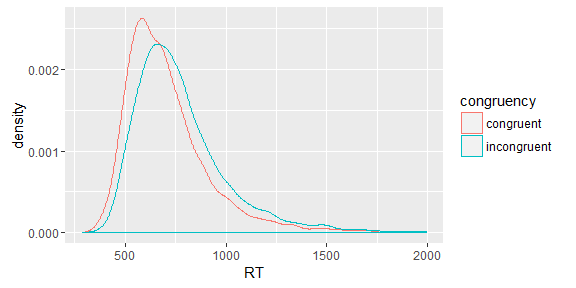
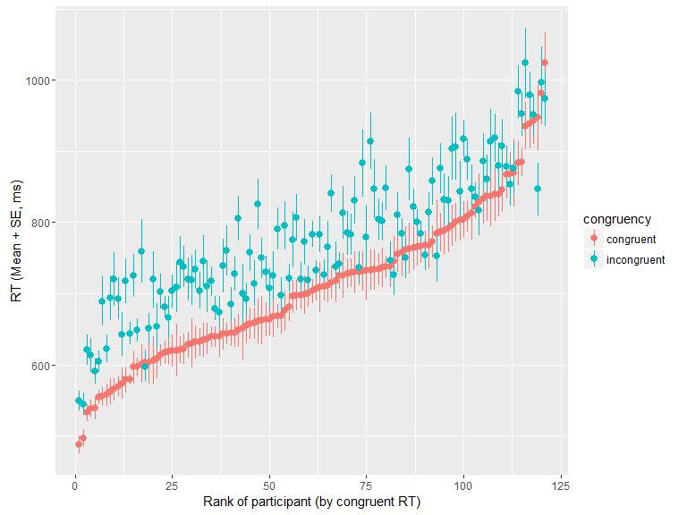
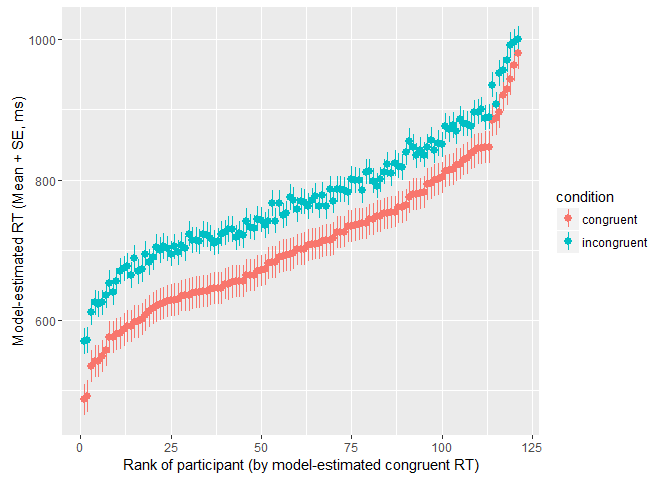
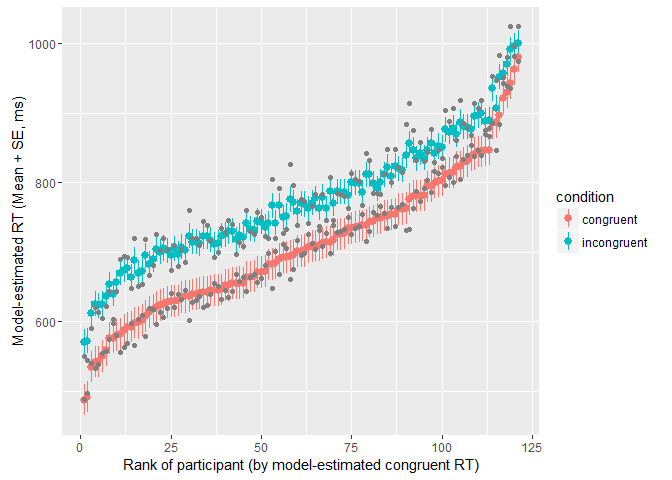

Does the stroop effect vary across people?
================
TJ Mahr
August 26, 2016

An attempt to work through [this example](https://jeffrouder.blogspot.com/2016/08/where-bayes-and-classical-inference.html).

Download and prepare data
-------------------------

``` r
library(dplyr, warn.conflicts = FALSE)
library(lme4)
#> Loading required package: Matrix
#> 
#> Attaching package: 'lme4'
#> The following object is masked from 'package:stats':
#> 
#>     sigma
library(rstanarm)
#> Loading required package: Rcpp
#> Warning: replacing previous import 'lme4::sigma' by 'stats::sigma' when
#> loading 'rstanarm'
#> rstanarm (Version 2.11.1, packaged: 2016-07-29 14:31:44 UTC)
#> - Do not expect the default priors to remain the same in future rstanarm versions.
#> Thus, R scripts should specify priors explicitly, even if they are just the defaults.
#> - For execution on a local, multicore CPU with excess RAM we recommend calling
#> options(mc.cores = parallel::detectCores())
#> 
#> Attaching package: 'rstanarm'
#> The following object is masked from 'package:lme4':
#> 
#>     sigma
library(ggplot2)
options(mc.cores = parallel::detectCores())

# Download dataset
filename <- curl::curl("https://raw.githubusercontent.com/PerceptionCognitionLab/data0/master/contexteffects/FlankerStroopSimon/LEF_stroop.csv")
raw_stroop <- readr::read_csv2(filename)
#> Parsed with column specification:
#> cols(
#>   ID = col_integer(),
#>   congruency = col_character(),
#>   RT = col_integer(),
#>   accuracy = col_integer()
#> )

# Keep a local copy just in case
readr::write_csv(raw_stroop, "./stroop_data.csv")

# Data cleaning
stroop <- raw_stroop %>%
  # Add trial numbers for each participant
  group_by(ID) %>%
  mutate(trial = seq_len(n()),
         rt_sec = RT / 1000) %>%
  ungroup %>%
  # Keep correct responses, ignore neutral trials, discard extreme RTs
  filter(accuracy == 1, congruency != "neutral", .2 < rt_sec, rt_sec < 2)
```

Ten random rows from the dataset:

``` r
stroop %>% 
  sample_n(10) %>% 
  knitr::kable()
```

|   ID| congruency  |    RT|  accuracy|  trial|  rt\_sec|
|----:|:------------|-----:|---------:|------:|--------:|
|   38| congruent   |  1054|         1|    110|    1.054|
|   58| congruent   |   575|         1|     21|    0.575|
|   44| congruent   |   676|         1|     18|    0.676|
|   71| incongruent |   743|         1|    140|    0.743|
|   90| incongruent |   593|         1|     99|    0.593|
|   90| congruent   |   600|         1|    115|    0.600|
|   91| congruent   |   823|         1|     12|    0.823|
|   88| congruent   |   623|         1|    115|    0.623|
|   95| congruent   |   989|         1|     12|    0.989|
|  100| congruent   |   740|         1|    130|    0.740|

Sanity check to make sure that people contribute roughly the same numbers of trials.

``` r
n_trials_per_condition_per_id <- stroop %>% count(ID, congruency)
range(n_trials_per_condition_per_id$n)
#> [1] 34 48
```

Overall all response distributions. We would normally transform RT, but won't for now.

``` r
ggplot(stroop) +
  aes(x = RT, color = congruency) +
  geom_density()
```



Visualize average RTs by participant and condition. Vertical distance between each pair of points is each participant's stroop effect.

``` r
# To have an ordered x-axis, rank participant by participants by their average
# congruent RT
ranked <- stroop %>% 
  filter(congruency == "congruent") %>% 
  group_by(ID) %>% 
  summarise(MeanRT = mean(RT)) %>%
  mutate(Rank = row_number(MeanRT)) %>% 
  select(-MeanRT)

with_ranks <- left_join(stroop, ranked)
#> Joining, by = "ID"

ggplot(with_ranks) +
  aes(x = Rank, y = RT, color = congruency) +
  stat_summary(fun.data = mean_se) +
  labs(x = "Rank of participant (by congruent RT)", 
       y = "RT (Mean + SE, ms)")
```



lme4
----

Fit two mixed effects models. First, a random-intercept model. This model allows participants to have varying average RTs, but it assumes a fixed stroop incongruency effect across the participants.

``` r
# Allow intercepts to vary within participant
model1 <- lmer(RT ~ congruency + (1 | ID), stroop)
summary(model1)
#> Linear mixed model fit by REML ['lmerMod']
#> Formula: RT ~ congruency + (1 | ID)
#>    Data: stroop
#> 
#> REML criterion at convergence: 151270.7
#> 
#> Scaled residuals: 
#>     Min      1Q  Median      3Q     Max 
#> -3.5868 -0.5958 -0.1857  0.3556  6.7862 
#> 
#> Random effects:
#>  Groups   Name        Variance Std.Dev.
#>  ID       (Intercept)  9478     97.35  
#>  Residual             39404    198.50  
#> Number of obs: 11245, groups:  ID, 121
#> 
#> Fixed effects:
#>                       Estimate Std. Error t value
#> (Intercept)            708.280      9.230   76.74
#> congruencyincongruent   64.582      3.746   17.24
#> 
#> Correlation of Fixed Effects:
#>             (Intr)
#> cngrncyncng -0.199

# expected delay in RTs in incongruent condition
fixef(model1)[["congruencyincongruent"]]
#> [1] 64.58167
```

Next, a random-slope model. This model allows the stroop incongruency effect to vary across participants. It estimates two additional parameters: the variance of varying stroop effects and the covariance of the random intercepts and varying stroop effects.

``` r
# Allow condition effect to vary within participants
model2 <- lmer(RT ~ congruency + (congruency | ID), stroop)
summary(model2)
#> Linear mixed model fit by REML ['lmerMod']
#> Formula: RT ~ congruency + (congruency | ID)
#>    Data: stroop
#> 
#> REML criterion at convergence: 151259.8
#> 
#> Scaled residuals: 
#>     Min      1Q  Median      3Q     Max 
#> -3.5447 -0.5996 -0.1807  0.3559  6.8254 
#> 
#> Random effects:
#>  Groups   Name                  Variance Std.Dev. Corr 
#>  ID       (Intercept)           10641.5  103.16        
#>           congruencyincongruent   517.7   22.75   -0.56
#>  Residual                       39274.4  198.18        
#> Number of obs: 11245, groups:  ID, 121
#> 
#> Fixed effects:
#>                       Estimate Std. Error t value
#> (Intercept)            708.266      9.736   72.75
#> congruencyincongruent   64.680      4.274   15.13
#> 
#> Correlation of Fixed Effects:
#>             (Intr)
#> cngrncyncng -0.426

# basically the same expected delay in RTs in incongruent condition
fixef(model2)[["congruencyincongruent"]]
#> [1] 64.68042
```

Because these are nested models, we can use a simple model comparison to test whether the two additional parameters improve model fit.

``` r
anova(model1, model2)
#> refitting model(s) with ML (instead of REML)
#> Data: stroop
#> Models:
#> model1: RT ~ congruency + (1 | ID)
#> model2: RT ~ congruency + (congruency | ID)
#>        Df    AIC    BIC logLik deviance  Chisq Chi Df Pr(>Chisq)   
#> model1  4 151289 151319 -75641   151281                            
#> model2  6 151283 151327 -75635   151271 10.732      2   0.004674 **
#> ---
#> Signif. codes:  0 '***' 0.001 '**' 0.01 '*' 0.05 '.' 0.1 ' ' 1
```

The AIC and chi-square statistic support a model with varying stroop effects.

### Visualizing lme4 estimates

One might ask whether the covariance term is necessary. By plotting the each participant's estimated intercept and stroop effect, we can see that the slower responders have a smaller stroop effect.

``` r
plot(coef(model2))
#> $ID
```


Get the estimated RTs and SEs for each participant. This takes a bit of rehaping.

``` r
# Get the predicted values for each participant
long_estimates <- broom::tidy(model2, "ran_modes") %>% 
  tibble::as_data_frame() %>% 
  select(-group) %>% 
  rename(se = std.error) %>% 
  # Some reshaping
  tidyr::gather(key, value, estimate, se) %>% 
  mutate(term = ifelse(term == "(Intercept)", "congruent", term),
         term = ifelse(term == "congruencyincongruent", "delay", term)) %>% 
  tidyr::unite(variable, term, key) %>% 
  tidyr::spread(variable, value) %>% 
  # Calculate the incongruency time as intercept plus incongruency effect
  mutate(incongruent_estimate = congruent_estimate + delay_estimate) %>% 
  select(-delay_estimate) %>% 
  rename(incongruent_se = delay_se) %>% 
  # Shape back into long format
  tidyr::gather(cond_term, value, -level) %>% 
  tidyr::separate(cond_term, into = c("condition", "term")) %>%  
  tidyr::spread(term, value) %>% 
  readr::type_convert() %>% 
  rename(ID = level)
#> Parsed with column specification:
#> cols(
#>   level = col_integer(),
#>   condition = col_character()
#> )
long_estimates
#> # A tibble: 242 x 4
#>       ID   condition estimate       se
#> *  <int>       <chr>    <dbl>    <dbl>
#> 1      1   congruent 641.7621 22.87287
#> 2      1 incongruent 722.5674 18.08475
#> 3     10   congruent 708.9728 22.58101
#> 4     10 incongruent 776.4687 18.02305
#> 5    100   congruent 830.1271 22.78615
#> 6    100 incongruent 879.7960 18.06210
#> 7    101   congruent 748.1534 22.52612
#> 8    101 incongruent 800.5423 18.01151
#> 9    102   congruent 586.9757 23.38214
#> 10   102 incongruent 673.7583 18.17591
#> # ... with 232 more rows

# Rank by estimate in congruent condition
est_ranks <- long_estimates %>% 
  filter(condition == "congruent") %>% 
  mutate(EstRank = row_number(estimate)) %>% 
  select(ID, EstRank)

# Attach ranks
long_estimates <- left_join(long_estimates, est_ranks)
#> Joining, by = "ID"
```

Visualize the estimates now.

``` r
p <- ggplot(long_estimates) + 
  geom_pointrange(aes(x = EstRank, y = estimate, color = condition,
      ymin = estimate - se, ymax = estimate + se)) + 
  labs(x = "Rank of participant (by model-estimated congruent RT)", 
       y = "Model-estimated RT (Mean + SE, ms)")
p
```



Visualize multilevel shrinkage by overlaying empirical means.

``` r
with_ranks <- with_ranks %>% left_join(est_ranks)
#> Joining, by = "ID"

p + 
  stat_summary(aes(x = EstRank, y = RT, group = congruency), data = with_ranks, 
               color = "grey50", fun.y = "mean", geom = "point")
```



Here's yet another shrinkage visualization. This one is about the covariance term, or the tendency for slower participants to have smaller stroop delays.

``` r
# Compute average RT in each condition and get difference between them.
delays <- with_ranks %>% 
  group_by(ID, congruency) %>% 
  summarise(MeanRT = mean(RT)) %>% 
  ungroup %>% 
  tidyr::spread(congruency, MeanRT) %>% 
  # `Value` column will differentiate empirical vs estimated 
  mutate(Delay = incongruent - congruent,
         Value = "Empirical") %>% 
  rename(Congruent = congruent) %>% 
  select(-incongruent)

# Get model random effects.
estimated <- coef(model2) %>% 
  getElement("ID") %>% 
  tibble::rownames_to_column("ID") %>% 
  rename(Congruent = `(Intercept)`, Delay = congruencyincongruent) %>% 
  mutate(Value = "Estimated") %>% 
  readr::type_convert()
#> Parsed with column specification:
#> cols(
#>   ID = col_integer(),
#>   Value = col_character()
#> )

both_sets <- bind_rows(delays, estimated)

ggplot(both_sets) +
  aes(x = Congruent, y = Delay) + 
  geom_path(aes(group = ID), color = "grey50") +
  geom_point(aes(color = Value)) + 
  labs(x = "RT for congruent items (ms)",
       y = "RT diff. (ms) for incongruent items")
```


Same points, but with linear regression lines overlaid to show how correlation between intercept/slope differ between the data and the model.

``` r
ggplot(both_sets) +
  aes(x = Congruent, y = Delay, color = Value) + 
  geom_point() + 
  stat_smooth(method = "lm") +
  labs(x = "RT for congruent items (ms)",
       y = "RT diff. for incongruent items (ms)")
```


rstanarm
--------

We can use rstanarm to fit Bayesian versions of these models. It took a couple hours for my computer to get 4000 MCMC samples from each model, so I will be loading cached results.

``` r
refit <- FALSE

# Let's not refit the models whenever this document is generated.
if (refit) {
  # Allow intercepts to vary within participant
  b_model1 <- stan_lmer(
    formula = RT ~ congruency + (1 | ID),
    data = stroop,
    prior = normal(0, 5),
    prior_covariance = decov(regularization = 1),
    prior_intercept = normal(0, 10))
  save(b_model1, file = "model1.Rdata")

  b_model2 <- update(b_model1, formula = RT ~ congruency + (congruency | ID))
  save(b_model2, file = "model2.Rdata")
} else {
  load("./model1.Rdata")
  load("./model2.Rdata")
}
```

There are too many effects for us to use`summary` on each model. The plain old `print` method of rstanarm approximates the lme4 `summary` method.

``` r
b_model1
#> stan_lmer(formula = RT ~ congruency + (1 | ID), data = stroop, 
#>     prior = normal(0, 5), prior_intercept = normal(0, 10), prior_covariance = decov(regularization = 1))
#> 
#> Estimates:
#>                       Median MAD_SD
#> (Intercept)           707.7    8.9 
#> congruencyincongruent  64.6    3.8 
#> sigma                 198.5    1.3 
#> 
#> Error terms:
#>  Groups   Name        Std.Dev.
#>  ID       (Intercept)  97     
#>  Residual             199     
#> Num. levels: ID 121 
#> 
#> Sample avg. posterior predictive 
#> distribution of y (X = xbar):
#>          Median MAD_SD
#> mean_PPD 740.2    2.7
b_model2
#> stan_lmer(formula = RT ~ congruency + (congruency | ID), data = stroop, 
#>     prior = normal(0, 5), prior_intercept = normal(0, 10), prior_covariance = decov(regularization = 1))
#> 
#> Estimates:
#>                       Median MAD_SD
#> (Intercept)           707.7    9.8 
#> congruencyincongruent  64.7    4.2 
#> sigma                 198.2    1.3 
#> 
#> Error terms:
#>  Groups   Name                  Std.Dev. Corr 
#>  ID       (Intercept)           103           
#>           congruencyincongruent  22      -0.55
#>  Residual                       198           
#> Num. levels: ID 121 
#> 
#> Sample avg. posterior predictive 
#> distribution of y (X = xbar):
#>          Median MAD_SD
#> mean_PPD 740.2    2.7
```

<!-- We can use WAIC to compare the models, but I am not sure if it's the right kind -->
<!-- of model comparison. -->
